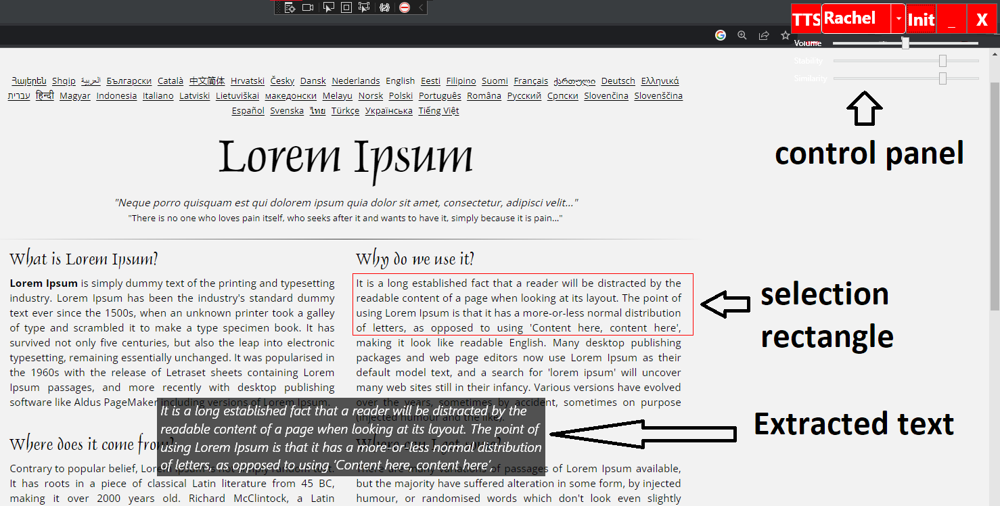

# Tesseract OCR with Eleven Labs to produce TTS audio

A small wpf application which uses Optical Character Recognition(**OCR** provided by Tesseract) to obtain text from the screen then uses **ElevenLabs** API to produce Text-To-Speech(**TTS**) audio.

The Audio files are saved under the `.\output` folder for later use.

# Requirements
* .net 7.0 [SDK](https://dotnet.microsoft.com/en-us/download/dotnet/7.0)
* Visual Studio 2022
* Register an account at [ElevenLabs](https://beta.elevenlabs.io/) and get the API key
* Tesseract language model file for the target language [download](https://github.com/tesseract-ocr/tessdata_fast) and place it under `.\tessdata`

# Command Line Arguments
| required | name | Description | Default Value | Possible Values |
| ---- | ---- | ---- | ---- | ---- |
| true | `--apikey` or empty | ElevenLabs api key | `null` | - |
| false | `--userAgent` or `-ua` | UserAgent in request header | `null` | `rand` or a specified UserAgent |
| false | `--proxy` or `-p` | Proxy | `null` | `rand` or specified Proxy with format `PROTOCOL://ADDRESS:PORT` |
| false | `--tpath` or `-p` | Tesseract Language model path | `.\tessdata` | - |
| false | `--lang` or `-l` | Tesseract file name File name without extension. | `eng` | [Possible filenames](https://github.com/tesseract-ocr/tessdata_fast) |

# `rand`om Proxy and UserAgent

Next to the executable there are two files `Proxys` and `UserAgents` you can edit these files freely as long as you keep the format, one entry per line.

When the `rand` argument is used for either UserAgent or Proxy, based on the ElevenLabs API key a deterministic random entry will be selected.

# Proxy Crawler

In the repo a provided proxy crawler `crawl.js` exists, tested at [spys.one](https://spys.one/europe-proxy/)

# Basic usage

After the wpf app started, should see the overlay control menu at the top right corner.

The app uses log files next to the executable `log_*`.

First thing first is to check if the connection can be made by pressing `Init` button. As a result the available voices should be populated.

Select the desired voice you want to use.

Select an area on the screen where the text are located. (This red rect remains and/or can be adjusted(position/resize))

It is possible to preview the extracted text by **double left click** on the red rectangle.

Finally either pressing the `TTS` button or using the `ALT+SPACE` hotkey initiates the ElevenLabs request.

Once the response are back, the audio should playback.

Incase you not happy with the result, you can adjust the `Stability=0.75` and `Similarity=0.75`.

Each time you adjust the voice settings a new file is generated and saved locally. `.\output`

If you happen to have choosen an already generated voice hash (`Voice`+`Similarity`+`Similarity`) it just plays back the audio file locally, no request is made.

---

It is possible to minimize the overlay with the `_` button or `SHIFT+ALT+SPACE`.

While the overlay is active its possible reposition the text via `1, 2, 3, 4` hotkeys.

While the overlay is active, pressing `ESC` exits the program.

# UI

  

